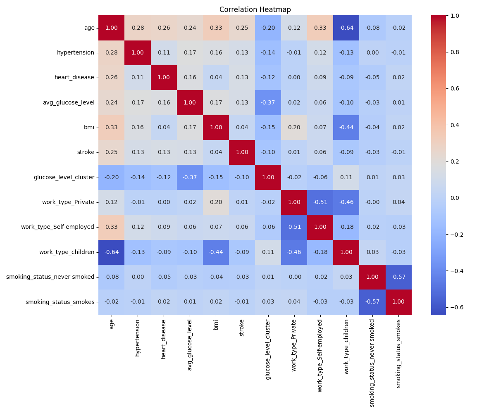
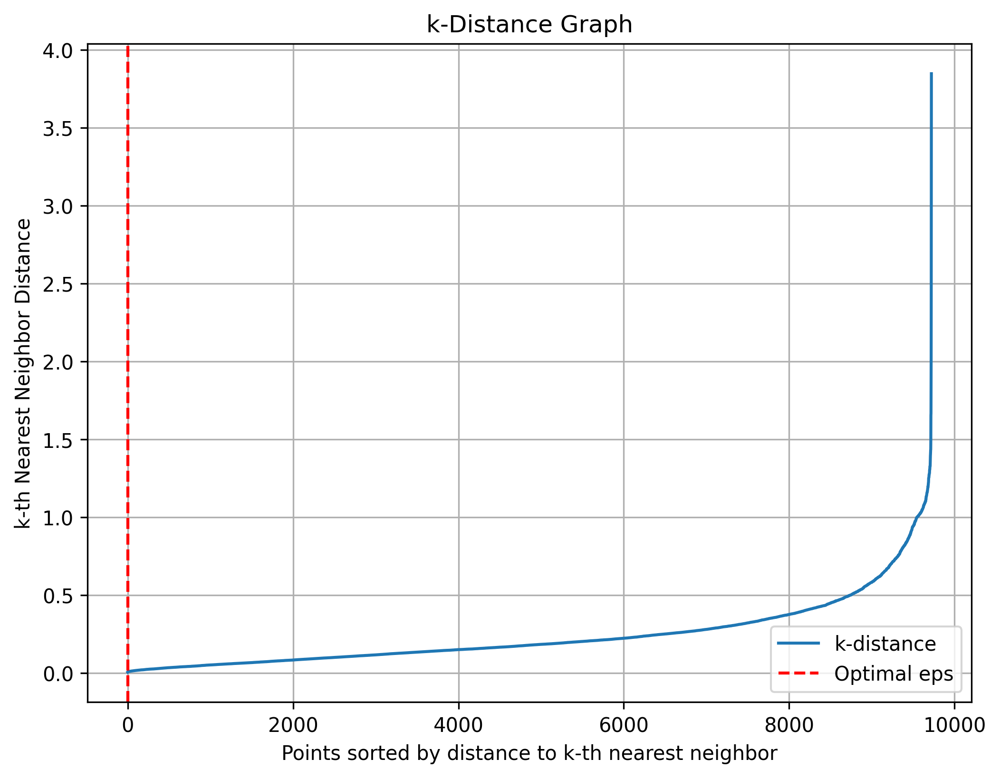
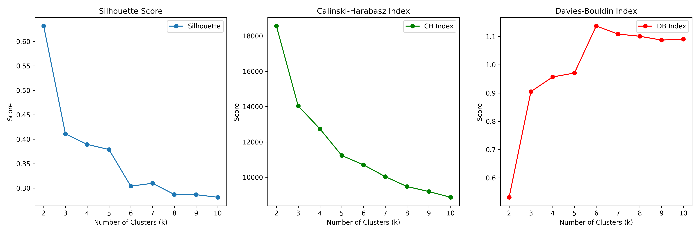
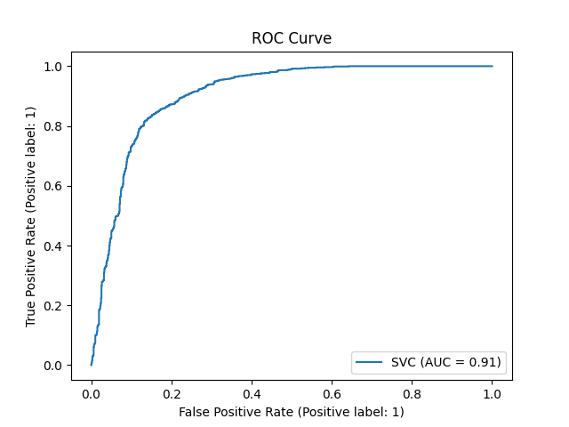
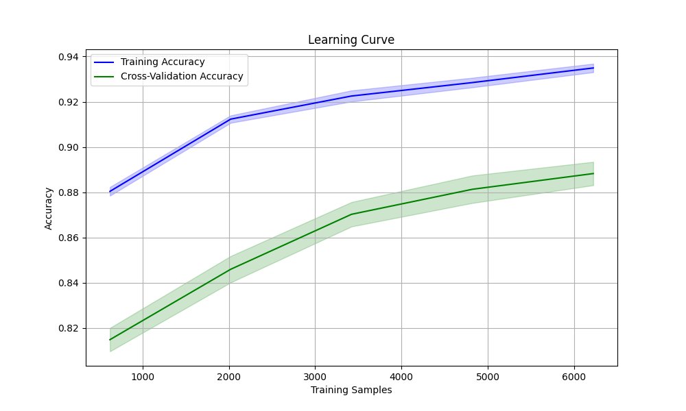

# CMPT459 Stroke Prevention Analytics

## Overview

This project focuses on analyzing the **Stroke Prediction Dataset** to extract patterns regarding stroke likelihood using various data mining techniques. Using techniques like clustering, classification, and exploratory data analysis (EDA), we hope to get insights into factors influencing stroke risk. The dataset was sourced from Kaggle, consisting of both numerical and categorical features, making it suitable for this task.

---

## Project Proposal

### Objective
Stroke has been identified as the second leading cause of death globally by the World Health Organization. Because of this, it is important to gain an early insight on the chances an individual can get a stroke to allow for intervention and prevention. In this project, through performing multiple data mining tasks, we wish to achieve the ability to predict the chance of someone having a stroke based on their various health-related attributes.

### Dataset Description
- **Name**: Stroke Prediction Dataset
- **Source**: [Kaggle](https://www.kaggle.com/datasets/fedesoriano/stroke-prediction-dataset)
- **Samples**: 5110 observations
- **Features**: 11 clinical and demographic attributes
  - **Target Feature**: `stroke` (1 for stroke, 0 for no stroke)
  - **Feature Types**: 7 numerical and 5 categorical variables
- **License**: Permissive for academic and research purposes

### Justification
- **Usability**: High-quality dataset with a usability score of 10.00 on Kaggle.
- **Structure**: CSV format with clear feature descriptions.
- **Relevance**: Directly addresses a critical healthcare issue.
- **Size**: Sufficient data for robust training, testing, and validation.
- **Diversity**: Balanced mix of feature types enables multiple analytical methods.

---

## Repository Structure

```
├── clustering_results/          # Results from clustering analysis (e.g., KMeans, DBSCAN)
├── data/                        # Raw and processed dataset files
├── eda_results/                 # EDA results (latest iteration)
├── eda_results_prev/            # Previous EDA versions for reference
├── output/                      # Outputs from models and evaluations (e.g., oversampling, classification results)
├── scripts/                     # Python scripts for preprocessing and analysis
├── EDA_Report.pdf               # Comprehensive EDA summary (PDF)
├── Snakefile                    # Workflow automation script (Snakemake)
├── README.md                    # Project documentation
├── requirement.txt              # Python dependencies
```

---

## Requirements

### Python Dependencies
Install the required libraries using:
```bash
pip install -r requirement.txt
```

### Key Libraries
- **Data Analysis**: `pandas`, `numpy`
- **Visualization**: `matplotlib`, `seaborn`
- **Modeling**: `sklearn`

---

## How to Use

1. **Clone the Repository**:
   ```bash
   git clone https://github.com/your-username/stroke-prediction-project.git
   cd stroke-prediction-project
   ```

2. **Install Dependencies**:
   ```bash
   pip install -r requirement.txt
   ```

3. **Execute Workflow**:
   Use Snakemake to automate the analysis pipeline:
   ```bash
   snakemake --cores 4
   ```

4. **View Outputs**:
   - Clustering results: `clustering_results/`
   - EDA summary: `EDA_Report.pdf`
   - Model evaluations: `output/`

---
## Report
### Method
#### Libraries Used
##### Snakemake
To tackle this problem, my group decided to use Snakemake, a powerful workflow management system that allows for reproducible and scalable data analyses. The decision of using Snakemake is based on its convenience in managing a multi step data analysis pipeline. This ensures that every step in the project, execution were in correct order with all dependencies resolved. Furthermore, the rules feature in Snakemake makes defining how data is transformed clearer, making it easy to recreate the pipeline. When collaborating using Snakemake, workload can be easily distributed due to rules and we can easily assist each other with its modularity when it comes to rules.
##### Python Library
-   imbalanced-learn

    -   A tool that addresses class imbalance issue in dataset

    -   Include advanced resampling techniques like SMOTE and ADASYN

-   kneed

    -   A tool to identify optimal parameter values

    -   Accurate detection of knee/elbow points in curves

-   Matplotlib

    -   A popular tool for creating visualizations to better understand
        and present data results

    -   It can tailored to any kind of visualization with a wide range
        for plot support

-   Numpy

    -   Popular tool for numerical computations with efficiency

    -   It support a broad range of mathematical operations

-   Pandas

    -   Popular tool used for organizing, cleaning, and analyzing
        structured dataset

    -   It offers a variety of data manipulation tools that allow
        exploratory data analysis and data wrangling

-   Pulp

    -   A tool for solving optimization problems

    -   It provide a simple syntax for defining and solving linear
        programming task

-   Scikit-learn

    -   Popular tool for implementing machine learning models and
        evaluation metrics

    -   It offers advanced comprehensive set of machine learning
        algorithms with detailed documentation and community support

-   Seaborn

    -   Used for creating visual appealing statistical plots
#### Exploratory Data Analysis (EDA)
In the EDA procedure, the preprocessing dataset (in CSV format) is used to analyze how consistent and representative the final dataset is for modeling and provide key features and relationships for feature engineering and model development. 

We performed EDA twice following the preprocessing procedure of the dataset, both with the same procedure. Histograms were plotted to identify potential skewness or outliers of each feature, with Kernel Density Estimation overlays to provide smooth approximations of these distributions. We also generated a correlation heatmap to visualize relationships between numerical features and represent highly correlated pairs that may affect the model. Additionally, boxplots of numerical features against the target variable, $stroke$, were also used for comparison in order to elicit patterns and differences among stroke and non-stroke cases.

These EDA steps have helped to determine the feature selection and preprocessing decisions. For example, features such as categorical variables (resident\_type, gender) with weak predictive power were marked to be dropped and important numerical features (hypertension, glucose, bmi, age) that might have an impact on the prediction task were underlined through insights taken from the boxplots. All outputs from EDA, including visualizations and correlation analyses, are saved for further analysis in order to guide feature engineering and model development.

#### Preprocessing
During Preprocessing, the dataset, in the format CSV, was loaded into python using $pandas$ library. When analyzing the dataset, the missing values in bmi were filled with the mean of the feature ensuring consistency in the data type and void model error. As for the Unknown column in smoking\_status, values are replaced by values based on existing category probabilities. This ensures a realistic imputation and avoids introducing bias when compared to replacing with only the mode or leaving unknown as its own type. We also applied One-hot encoding to work\_type to reduce sparsity and simplify the data.

Based on the EDA results, features id, ever\_married, Residence\_type, and gender were dropped due to their weak predictive power as identified in the EDA. Also, the avg\_glucose\_level was clustered using KMeans, creating discrete bins, addressing the bimodal distribution of glucose levels identified in the EDA, and making it easier to identify patterns or relationships in the data. Lastly, all numerical features were scaled using RobustScaler. This ensures features have similar ranges, which prevents certain features from dominating others. 

To address the class imbalance problem in the dataset, identified during EDA, we applied Synthetic Minority Oversampling Technique (SMOTE). Since, the case where stroke = 1 is only \~4.87\% of the data, SMOTE was used to generate synthetic samples for it. This outputs two files, the oversampled csv file for later analysis and a plot visualizing the class distribution after oversampling.

#### Outlier Detection
##### Isolation Forest
Isolation forest is one of the methods we used to detect anomalies. It is an unsupervised decision tree based algorithm focuses on identifying outliers in the dataset. We used it to tune the dataset based on various hyperparameters and visualizing the result. The parameters of the algorithm, like number of estimators, contamination level, and sampling proportions, are tuned using a systematic grid search to find the optimal configuration. To evaluate the metrics, we included computation of precision, recall, F1-score, and ROC-AUC. Also, PCA was used to reduce the data to a 3d scatter plot for visualization. It shows how outliers are distributed in the feature space.

##### Local Outlier Factor (LOF)
Local Outlier Factor is another method we chose to detect outliers from the dataset based on their local density relative to their neighbors. The hyperparameters of number of neighbors and contamination were tuned to optimize the detection process.

-   *Hyperparameter Tuning*: LOF was applied iteratively on a range of
    values for n_neighbors (\[10, 20, 30, 40\]) and contamination
    (\[0.05, 0.1, 0.15, 0.2\]). For every combination, the number of
    detected outliers was calculated in order to assess. The best
    parameters were chosen if detecting the maximum number of outliers
    where meaningful clustering was preserved.

-   *Visualization of Outliers:* PCA was performed to project the
    original feature space into a three-dimensional space. In this 3D
    scatter plot, inliers and outliers are shown in order to see how the
    LOF algorithm has classified the data.

#### Clustering
##### DBSCAN
The Density-Based Spatial Clustering of Applications with Noise (DBSCAN) provides insights into the structure of the dataset through identifying clusters and labeling noise points. 

To determine the optimal parameters, k-distance graph was used to identify the optimal $eps$ value. It first by plotting the sorted distances to the kth nearest neighbours. Then those data points are put into the KneeLocator library to determine the knee point in the graph, indicating the most appropriate $eps$ value for DBSCAN. 

As for the parameter min\_samples, the code iterates over a range of values, with clustering metrics such as the Davies-Bouldin Index (Indicates the average similarity between clusters, want lower score), Silhouette Score (cohesion and separation of clusters, want bigger score), Calinski-Harabasz Index (Measures the ratio of cluster dispersion to inter-cluster distances, want bigger score), and Adjusted Rand Index (ARI) (Measures the similarity between the DBSCAN labels and the ground truth (stroke column), want higher score) used to select the best combination of eps and min\_samples.

##### KMeans
K-Means is an unsupervised machine learning algorithm we selected to cluster data into groups by minimizing the distance between data points and their cluster centroids. The clustering result helped us take away key groups of stroke risk factors.

To acquire the optimum clustering result, the number of clusters (k) was tuned by apply KMeans on the dataset iteratively with different k values ranging from 2 to 10. Clustering performance was evaluated using three metrics including Silhouette Score (want higher score), Calinski-Harabasz Index (want higher score) and Davies-Bouldin Index (measure the compactness and separation of clusters, want lower score).

To better understand how KMeans react with outliers, we also perform KMeans with outliers removal to evaluate how the result is affected. The clustering results were visualized in a 3D scatter plot using the PCA with distinct colors assigned to each cluster to provide insights into the grouping patterns within the dataset.

#### Feature Selection
##### Recursive Feature Elimination (RFE)
Recursive Feature Elimination (RFE) was applied to help us detect important predictors for the classification task. Before apply, the features were scaled using StandardScaler to ensure all numerical features were standardized, preventing any feature with a larger range from dominating the model's performance.

We chose the Random Forest Classifier as the estimator for RFE for its high precision and ability to handle both numerical and categorical features effectively. For the procedure, RFE recursively eliminated features that were less important by fitting the Random Forest model multiple times until the desired number of features (10) was selected. 

To evaluate the performance and RFE impacts on the classification task, we perform a Support Vector Machine classifier on the dataset (more in the $Classification$ task) with and without reduced features from RFE, then look into the accuracy rate as well as computational efficiency

##### Mutual Information
One of the features we used was Mutual Information (MI) to identify the most relevant features for a target variable. The choice of using Mutual Information for this dataset is based on the following consideration. Since the MI measures the dependency between each feature and the target variable, making it apply perfectly to this dataset where it is composed of mixed data types and potential nonlinear relationships. Through calculating the MI scores that measure the dependency between each feature and target, only the top k features with the highest MI scores are kept. This will ensure the downstream model has an increased interpretability and performance. 

#### Classification
##### Support Vector Machine (SVM)
The Support Vector Machines works by the principle of finding the optimum hyperplane that maximizes the margin between classes in a feature space, such that it separates data points into respective categories.
The data was split into training and testing sets in the ratio 80:20 using stratified sampling to train the model while ensuring the model can make accurate predictions on new, real-world data and is not overfitting to the training data. We used the SVM classifier from the $sklearn.svm.SVC$ library with the RBF kernel to capture non-linear relationships within the data.

Moreover, the 5-fold stratified cross-validation of the model was performed to estimate the robustness using the training set. This ensures that different subsets of the data have been used to test the model and minimize overfitting.

The performance of this model was measured on the test and training sets using accuracy, precision, recall, F1-score, and AUC-ROC. Additionally, we also plotted a confusion matrix to provide insight into true positives, true negatives, false positives, and false negatives, and the ROC curve to highlight the trade-offs of sensitivity and specificity of the model

##### Random Forest
For classification, one of the methods we used is random forest classifier. This method emphasizes both performance and interpretability. StrtifiedKFold method was used to do a 5 fold cross validation to assess model stability and reduce overfitting. Currently, the configuration is set to be max\_depth=15, min\_samples\_split=10, and min\_samples\_leaf=5, this will be further tuned in the hyperparameters tuning process. Out of Bag (OOB) scoring is enabled to provide more validation without requiring a separate validation set. Additionally, the code provides visuals like Feature Importance Plot, Confusion Matrix, ROC Curve, Cross-Validation Score Distribution, and Learning Curve to get more insight into the model.

#### Hyperparamter Tuning
##### Random Search
With the purpose of improving the performance of SVM classifier, we tuned the hypeparameter of SVM with Random Search, a technique that randomly samples hyperparameter combinations from a predefined search space in order to efficiently explore the parameter landscape without exhaustive search. The search space included all critical SVM parameters:
-   C (Regularization Strength): Sampled from a uniform distribution
    between 0.1 and 10.0 to balance model complexity and generalization.

-   Kernel Types: linear, rbf, poly, and sigmoid to determine the best
    mapping function to separate data.

-   Degree: The degree was tested on 2, 3, and 4 to optimize flexibility
    on the polynomial kernel.

-   Gamma: scale and auto to define the influence of each feature on the
    decision boundary.

With the search space, we ran RandomizedSearchCV 50 iterations of hyperparameter sampling with 5-fold cross-validation, scoring each combination to identify the best configuration on accuracy. After finding the best parameters using cross-validation, the model was trained on all the training and test sets with resulting metrics such as precision, recall, and F1-score, and visualization of the confusion matrix and ROC curve.

##### Halving Grid Search
In this method, the code combines mutual information-based feature selection with Random Forest classification to optimize predictive accuracy while reducing computational overhead. It will first calculate MI score for features, selecting the top k features. Then the Random Forest model is trained for each selected feature subset using HalvingGridSearchCV. This is a function provided in SciKit-Learn that tunes hyperparameters efficiently. Through HalvingGridSearchCV, it explores various k values to determine the best combination of features and hyperparameters. The output will show training and testing accuracy, along with visualization of metrics and feature importances.

HalvingGridSearchCV is currently an experimental hyperparameter optimization technique that is provided by scikit-learn. It uses successive halving, which unlike GridSearchCV where it exhaustively evaluates all combinations of the hyperparameters, it begins with larger pools of hyperparameters, and progressively narrows down its search space by retaining only the top performing configurations. 

This is still experimental as it is still a relatively new addition to the package. Although it lacks robustness and stability, it provides advantages over efficiency, and scalability over GridSearchCV.

### Results
#### Exploratory Data Analysis (EDA)
<figure id="fig:histogram">

<figcaption>Histograms of all features in the dataset</figcaption>
</figure>
-   **Age**: unimodal distribution and slightly skewed to the right.
    Most individuals are around the middle-age range, fewer at the
    extremes (younger and older), may need some scaling.

-   **Hypertension & Heart Disease (binary)**: Highly skewed toward 0,
    limiting generalization in detecting positive cases. May address
    with oversampling

-   **Avg_glucose_level**: Skewed distribution with long tails toward
    higher values. Strong indicator for stroke, but extreme outliers may
    skew model learning.

-   **BMI**: Looks roughly normal, centered around the mean. Outliers in
    both the low and high ranges may affect clustering or regression
    analysis.

-   **Stroke** (target): Strong class imbalance with most cases being
    non-stroke (0), might have biased models favoring the majority
    class.

-   **Glucose_level_cluster**: The majority falls into low glucose level
    with fewer cases in the higher level which may not be represented
    well.

-   **Work_type_private, work_type_self_employed, work_type_children**:
    Dominance of private sectors, underrepresentation in “self_employed”
    and “children”

-   **Smoking_status and Smoking_status_never_smoked**: The majority do
    not currently smoke. A fairly balanced distribution between
    never_smoked and smoked groups, good variations for modeling

<figure id="fig:correlation-heatmap">

<figcaption>Correlation Heatmap between Features in the
dataset</figcaption>
</figure>
-   **Correlation with Stroke:**

    -   **Positive Relation:**

        -   **Age**: The strongest positive correlation with stroke
            (0.25), indicating older people are more likely to have a
            stroke.

        -   **Avg\_ glucose_level:** Higher glucose levels (possibly
            indicative of diabetes) are weakly associated with stroke
            (0.13).

        -   **Hypertension & Heart_disease:** light positive relation
            with stroke (0.13), suggesting they play a role in stroke
            risk but not the strongest factors

        -   **BMI:** very weak positive correlation with stroke (0.04),
            suggesting that obesity may not be a strong standalone risk
            factor in this dataset.

        -   **Work_Type (Private, Self-Employed)**: Minimal correlation
            with stroke (0.01 and 0.06 respectively), these alone may
            not be strong predictors.

    -   **Negative Relation**

        -   **Glucose_level_cluster** (-0.10): a slight negative
            relationship, which may need further interpretation based on
            how the clusters were defined.

        -   **Smoking_status_smokes** (-0.10): slight negative
            correlation with stroke, may need more analysis.

        -   **Work_type_children** (-0.09)
            **smoking_status_never_smoked** (-0.03): show negligible or
            no meaningful correlation with stroke.

-   **Correlation between Features:**

    -   **Age and BMI**: Moderate positive correlation (0.33), possibly
        due to weight gain with age.

    -   **Age and Work_type_children**: Strong negative correlation
        (-0.64), as younger individuals are more likely unemployed

    -   **Smoking_status_never_smoked and Smoked:** Strong negative
        correlation (-0.57) due to mutually exclusive categories in
        one-hot encoding.

    -   **Avg_glucose_level and glucose_level_cluster:** Strong negative
        correlation (-0.37) due to mutually exclusive categories in
        one-hot encoding.

    -   BMI and work_type_children (-0.44): moderate negative
        correlation, possibly because children have lower BMI values
        compared to adults

<figure id="fig:boxplots">

<figcaption>Boxplots of all Features vs. Stroke (target
variable)</figcaption>
</figure>
-   **Age**: There is a strong distinction between stroke and non-stroke
    cases, with stroke patients tending to be older. This can be a risk
    factor for stroke cases.

-   **Hypertension & Heart Disease (binary)**: stroke cases have more
    instances having hypertension and heart disease. However, these
    features are not strong differentiators due to predominant 0 values.

-   **Avg_glucose_level:** Higher glucose levels appear more common in
    the stroke group, suggesting a potential link but this might be
    hindered by outliers in non-stroke cases.

-   **BMI**: slight differences between stroke and non-stroke groups.
    Some outliers (extreme BMI values) in both groups might require
    closer handling.

-   **Avg_glucose_level_cluster:** Stroke cases are likely to form
    clusters with lower glucose levels than non-stroke cases. Those in
    the higher glucose clusters might be under-represented in stroke
    cases compared to their population size

-   **Working_type** (private, self_employed, children): Certain
    categories like "children" and "self-employed" are underrepresented.
    For the private sector, the distribution is nearly balanced across
    stroke outcomes with limited predictive power.

#### Outlier Detection
##### Isolation Forest
The 3D PCA plot reduced the dataset's feature dimensions and showcased the majority of the data points are tightly grouped into regions. This visual provide insight into the separation between the main clusters and outliers.
<figure id="fig:isoforest_plot">

<figcaption>Isolation Forest Outlier Detection Result Plot</figcaption>
</figure>


<figure id="fig:isoforest_plot">

<figcaption>A</figcaption>
</figure>
<figure id="fig:isoforest_plot">

<figcaption>B</figcaption>
</figure>
<figure id="fig:isoforest_plot">

<figcaption>C</figcaption>
</figure>
<figure id="fig:isoforest_plot">

<figcaption>D</figcaption>
</figure>
<figure id="fig:isofor_anomaly">

<figcaption>Figures represent anomaly scores plot of isolation forest at
different parameters (a) contamination = 0.001, estimators = 50 (b)
contamination = 0.001, estimators = 55 (c) contamination = 0.005,
estimators = 50 (d) contamination = 0.005, estimators = 55</figcaption>
</figure>

The anomaly scores plots provide inslight into the model's decision making process. The decision boundary (red dashed line), separate the dataset into two groups. Anything below the boundary are consider as outliers, while above are consider as inliers.

<figure id="fig:isoforest_tuning_plot">

<figcaption>Isolation Forest Tuning Summary Plot</figcaption>
</figure>

The tuning summary graph shows the impact of different contamination parameters on anomaly detection. It shows the trend for average inlier score and the proportion of detected outliers.

##### Local Outlier Factor (LOF)
Higher contamination values lead to more outliers being identified while the number of neighbors did not significantly affect the number of detected outliers.

| n_neigbors | Contamination | n_outliers |
|:-----------|:--------------|:-----------|
| 10         | 0.05          | 487        |
| 10         | 0.1           | 973        |
| 10         | 0.15          | 1459       |
| 10         | 0.2           | 1945       |
| 20         | 0.05          | 487        |
| 20         | 0.1           | 973        |
| 20         | 0.15          | 1459       |
| 20         | 0.2           | 1945       |
| 30         | 0.05          | 487        |
| 30         | 0.1           | 973        |
| 30         | 0.15          | 1459       |
| 30         | 0.2           | 1945       |
| 40         | 0.05          | 487        |
| 40         | 0.1           | 973        |
| 40         | 0.15          | 1459       |
| 40         | 0.2           | 1945       |
|            |               |            |

Table: LOF Parameters Tuning Results

**Best hyperparameters** are: n_neighbors=10, contamination=0.2

<figure id="fig:lof_plot">

<figcaption>Local Outlier Detection Result Plot</figcaption>
</figure>

**PCA Visualization** with Outliers detection from the best
hyperparameters:

-   Outliers are at the edge of the clusters, far away from the central
    trend formed by the inliers.

-   Outliers are not random but appear to cluster in certain areas,
    which may represent patterns that are unique to edge cases of
    health-related characteristics.

#### Clustering
##### DBSCAN
By applying DBSCAN to the dataset, the following table is the results we got from running the DBSCAN with the same parameters with original oversampled dataset and dataset after outlier detection.

| Results | DBSCAN w/o Outlier Detection | DBSCAN with Outlier Detection |
|:---|:---|:---|
| Silhouette Score | 0.483 | 0.4780 |
| Calinski-Harabasz Index | 4664.4 | 4662.6 |
| Davies-Bouldin Index | 1.2271 | 1.5939 |
| Adjusted Rand Index | 0.0542 | 0.05477 |
| Number of Clusters | 2 | 2 |
| Noise Points | 15 | 24 |
| Best eps | 1.1959 | 1.1788 |
| Best min\_samples | 5 | 14 |
|  |  |  |

Table: DBSCAN Result Comparison

<figure id="fig:lof_plot">

<figcaption>K distance plot of data points after DBSCAN without Outlier Detection</figcaption>
</figure>
<figure id="fig:lof_plot">

<figcaption>K distance
plot of data points after DBSCAN with Outlier Detection</figcaption>
</figure>

The two k distance plot above, by visualizes the distance to the k-th nearest neighbor for each data point in the dataset, was used to determine the optimal value for $eps$ parameter in DBSCAN through identifying its knee or elbow.

<figure id="fig:lof_plot">

<figcaption>3D cluster plot of data points after DBSCAN without Outlier Detection. </figcaption>
</figure>
<figure id="fig:lof_plot">

<figcaption>3D cluster plot of data points after DBSCAN with Outlier Detection</figcaption>
</figure>

The 3D plot, created using PCA, provides a visual representation of the clustering results from DBSCAN 

##### KMeans
Based on the metrics, k=2 is the optimal number of clusters as it has the best scores for Silhouette, Calinski-Harabasz, and Davies-Bouldin metrics:
-   At k=2, the Silhouette Score is highest (0.63) and declines with
    higher k, suggesting that the data fits best into two clusters.

-   For k=2, the Calinski-Harabasz index peaks at 18635.77 and drops
    significantly with increasing k, indicating reduced clustering
    quality with more clusters.

-   For k=2, the lowest Davies-Bouldin Index is k=2 (0.53), indicating
    the best compact and separated clusters.

<figure id="fig:kmeans_evaluation">

<figcaption>Evaluation Metrics of KMeans with different values of
k</figcaption>
</figure>

<figure id="fig:kmeans_evaluation">

<figcaption>3D cluster plot of data points after KMeans without Outlier Detection.</figcaption>
</figure>
<figure id="fig:kmeans_evaluation">

<figcaption>3D cluster plot of data points after KMeans with Outlier Detection</figcaption>
</figure>

**PCA Visualization:** shows 2 distinct clusters in the reduced 3D space
in both with and without outliers, as shown with 2 groups of points in
purple and yellow.

-   With Outliers:

    -   Points within each cluster are highly dense, clusters are
        compact and internally cohesive.

    -   Some outlier points deviate slightly from the main group.

    -   Minimal overlap between 2 clusters, may indicate some shared
        attributes between the two groups that require further study.

-   Without Outliers:

    -   The resulting clusters are better centered around the majority
        of data points, making the model more interpretable.

    -   Clearer distinction between clusters, points that previously
        stretched the cluster boundaries are no longer present,
        resulting in tighter and more meaningful clusters.

#### Feature Selection
##### Recursive Feature Elimination (RFE)
['age', 'hypertension', 'heart\_disease', 'avg\_glucose\_level', 'bmi', 'glucose\_level\_cluster', 'work\_type\_Private', 'work\_type\_Self-employed', 'work\_type\_children', 'smoking\_status\_never\_smoked']

| Metrics          | With RFE (%) | Without RFE (%) |
|:-----------------|:-------------|:----------------|
| Mean CV accuracy | 83.35        | 82.56           |
| Std CV accuracy  | 0.21         | 0.43            |
| Train Accuracy   | 84.65        | 83.59           |
| Test Accuracy    | 83.13        | 82.93           |
| Precision        | 78.65        | 78.27           |
| Recall           | 90.95        | 91.15           |
| F1-Score         | 84.35        | 84.22           |
| AUC-ROC          | 91.20        | 90.63           |
|                  |              |                 |

Table: Performance of SVM classifier with and without RFE

Computational Efficiency: RFE faster due to a smaller feature set, reducing computational overhead during training and inference.

##### Mutual Information
The MI scores of each features are shown below. Features with moderate to low MI scores were also included in the feature selection process. The selected features are: ['age', 'hypertension', 'heart\_disease', 'avg\_glucose\_level', 'bmi', 'glucose\_level\_cluster', 'work\_type\_Self-employed', 'work\_type\_children', 'smoking\_status\_never smoked', 'smoking\_status\_smokes']

| Mutual Information Scores   |        |
|:----------------------------|:-------|
| age                         | 0.5426 |
| hypertension                | 0.0479 |
| heart_disease               | 0.0497 |
| avg_glucose_level           | 0.0696 |
| bmi                         | 0.4543 |
| glucose_level_cluster       | 0.0503 |
| work_type_Private           | 0.0018 |
| work_type_Self-employed     | 0.0125 |
| work_type_children          | 0.0501 |
| smoking_status_never smoked | 0.0042 |
| smoking_status_smokes       | 0.0015 |
|                             |        |

Table: Mutual Information Scores for All Features

#### Classification
##### Support Vector Machines (SVM)
The performance of SVM is evaluated with various metrics:
| Metrics          | Performance of SVM (%) |
|:-----------------|:-----------------------|
| Mean CV accuracy | 82.56                  |
| Std CV accuracy  | 0.43                   |
| Train Accuracy   | 83.59                  |
| Test Accuracy    | 82.93                  |
| Precision        | 78.27                  |
| Recall           | 91.15                  |
| F1-Score         | 84.22                  |
| AUC-ROC          | 90.63                  |
|                  |                        |

Table: Performance of SVM classifier

<figure id="fig:kmeans_evaluation">

<figcaption>Confusion Matrix after applying SVM Classifier.</figcaption>
</figure>
<figure id="fig:kmeans_evaluation">

<figcaption>ROC Curve after applying SVM</figcaption>
</figure>

**Confusion Matrix:**

-   *True Negatives:* 741 cases correctly classified as non-stroke.

-   *False Positives:* 232 non-stroke cases misclassified as stroke.

-   *True Positives:* 865 stroke cases correctly identified.

-   *False Negatives:* 107 stroke cases missed by the model.

**The ROC curve** (AUC = 0.91) demonstrates a high true-positive rate
and a low false-positive rate across different thresholds.

##### Random Forest
Through evaluating the dataset with Random Forest, the following are the
metrics and results obtained. **Random Forest Without Mutual
Information**

-   **Model Performance**

    -   **Cross-Validation Scores**: \[0.89203085, 0.88753213,
        0.90032154, 0.89389068, 0.89003215\]

    <!-- -->

    -   **Mean CV Accuracy**: 0.89

    <!-- -->

    -   **Standard Deviation**: 0.00

    <!-- -->

    -   **Out-of-Bag (OOB) Score**: 0.90

    <!-- -->

    -   **Training Accuracy**: 0.94

    <!-- -->

    -   **Testing Accuracy**: 0.90

-   **Plots**

    -   **ROC Curve:** The AUC was **0.97**, indicating excellent
        discrimination between classes.

    -   **Confusion Matrix:** Correctly classified 858 (No Stroke) and
        902 (Stroke) instances, with 115 and 70 misclassifications,
        respectively.

    -   **Learning Curve:** Training accuracy steadily approached 0.94,
        with cross-validation accuracy stabilizing at around 0.89.

    -   **Feature Importances:** Age, BMI, and Avg Glucose Level were
        the top contributors.

| Metrics          | Precision (%) | Recall (%) | F1-score (%) | Support |
|:-----------------|:--------------|:-----------|:-------------|:--------|
| 0 (No stroke)    | 92            | 88         | 90           | 973     |
| 1 (Stroke)       | 89            | 93         | 91           | 972     |
| Accuracy         |               |            | 90           | 1945    |
| Macro Average    | 91            | 90         | 90           | 1945    |
| Weighted Average | 91            | 90         | 90           | 1945    |

Table: Random Forest without MI Metric

<figure id="fig:kmeans_evaluation">

<figcaption>Confusion Matrix of Random Forest without MI.</figcaption>
</figure>
<figure id="fig:kmeans_evaluation">

<figcaption>Learning Curve of Random Forest without MI.</figcaption>
</figure>
<figure id="fig:kmeans_evaluation">

<figcaption>Feature Importance of Random Forest without MI.</figcaption>
</figure>
<figure id="fig:kmeans_evaluation">

<figcaption>ROC Curve of Random Forest without MI</figcaption>
</figure>

**Random Forest with Mutual Information**

-   **Model Performance**

    -   **Cross-Validation Scores**: \[0.88817481, 0.88946015,
        0.89839228, 0.89131833, 0.88038585\]

    <!-- -->

    -   **Mean CV Accuracy**: 0.89

    <!-- -->

    -   **Standard Deviation**: 0.01

    <!-- -->

    -   **Out-of-Bag (OOB) Score**: 0.90

    <!-- -->

    -   **Training Accuracy**: 0.93

    <!-- -->

    -   **Testing Accuracy**: 0.90

-   **Plots**

    -   **ROC Curve:** The AUC was **0.97**, consistent with the model
        without MI.

    -   **Confusion Matrix:** Correctly classified 846 (No Stroke) and
        897 (Stroke) instances, with 127 and 75 misclassifications,
        respectively.

    -   **Learning Curve:** Training accuracy approached 0.93, with
        cross-validation accuracy stabilizing at 0.89.

    -   **Feature Importances:** Age, BMI, and Avg Glucose Level
        remained key features, emphasizing the importance of features
        with high MI.

| Metrics          | Precision (%) | Recall (%) | F1-score (%) | Support |
|:-----------------|:--------------|:-----------|:-------------|:--------|
| 0 (No stroke)    | 92            | 87         | 89           | 973     |
| 1 (Stroke)       | 88            | 92         | 90           | 972     |
| Accuracy         |               |            | 90           | 1945    |
| Macro Average    | 90            | 90         | 90           | 1945    |
| Weighted Average | 90            | 90         | 90           | 1945    |
|                  |               |            |              |         |

Table: Random Forest with MI Metric

<figure id="fig:kmeans_evaluation">

<figcaption>Confusion Matrix of Random Forest with MI.</figcaption>
</figure>
<figure id="fig:kmeans_evaluation">

<figcaption>Learning Curve of Random Forest with MI.</figcaption>
</figure>
<figure id="fig:kmeans_evaluation">

<figcaption>Feature Importance of Random Forest with MI.</figcaption>
</figure>
<figure id="fig:kmeans_evaluation">

<figcaption>ROC Curve of Random Forest with MI</figcaption>
</figure>

#### Hyperparameter Tuning
##### Random Search
Applying Random Search on SVM classifier, the **best parameters:** are
’C’: 7.213419527486499, ’degree’: 4, ’gamma’: ’scale’, ’kernel’: ’poly’,
’probability’: True

| **Metric** | **Class 0 (No Stroke)** | **Class 1 (Stroke)** | **Overall** |
|:---|:--:|:--:|:--:|
| Precision (%) | 88 | 82 | 85 |
| Recall (%) | 81 | 89 | 85 |
| F1-Score (%) | 84 | 86 | 85 |
| Accuracy (%) | **85.09** |  | 85 |
| AUC-ROC (%) | **92.00** |  | 92 |
| Support (instances) | 973 | 972 | 1945 |

Performance Metrics of the Tuned SVM Classifier

<figure id="fig:kmeans_evaluation">

<figcaption>Confusion Matrix after applying SVM Classifier with the Best Hyperparameters using Random Search</figcaption>
</figure>
<figure id="fig:kmeans_evaluation">

<figcaption>ROC Curve after applying SVM Classifier with the Best Hyperparameters using Random Search.</figcaption>
</figure>

**Confusion Matrix:**

-   *True Positives* (Stroke detected correctly): 902

-   *False Positives* (No Stroke misclassified as Stroke): 203

-   *True Negatives* (No Stroke detected correctly): 770

-   *False Negatives* (Stroke missed): 70

**ROC Curve:** The curve demonstrates an AUC of 0.93, reflecting
excellent sensitivity and specificity.

##### Halving Grid Search

| Metrics           | k = 8 | k = 9 | k = 10 |
|:------------------|:------|:------|:-------|
| n_estimators      | 300   | 100   | 300    |
| max_features      | log2  | log2  | log2   |
| min_samples_split | 5     | 15    | 20     |
| CV Accuracy (%)   | 90.91 | 90.64 | 91.93  |
| Test Accuracy (%) | 92.08 | 91.47 | 92.85  |
| Precision (%)     | 92.15 | 91.61 | 92.91  |
| Recall (%)        | 92.08 | 91.47 | 92.85  |
| F1-Score (%)      | 92.08 | 91.46 | 92.85  |
|                   |       |       |        |

Table: Halving Grid Search Hyperparameter Result

From this table, we can say when k = 10, Random Forest performs the best
under the same halving grid search tuning. The following plot are
obtained from the most optimal Random Forest Model at k = 10 for Mutual
Information.

<figure id="fig:kmeans_evaluation">

<figcaption>Confusion Matrix of Most Optimal Random Forest with MI</figcaption>
</figure>
<figure id="fig:kmeans_evaluation">

<figcaption>Learning Curve of Most Optimal Random Forest with MI</figcaption>
</figure>
<figure id="fig:kmeans_evaluation">

<figcaption>Feature Importance of Random Forest with MI.</figcaption>
</figure>
<figure id="fig:kmeans_evaluation">

<figcaption>ROC Curve of Most Optimal Random Forest with MI</figcaption>
</figure>

Because HalvingGridSearch is fairly new and experimental, the following is a plot that showcases the processes of HalvingGridSearch as it finds the most optimal hyperparameter.

<figure id="fig:grid_search_progress_plot">

<figcaption>Halving Grid Search Progress Plot</figcaption>
</figure>

### Discussion
#### Exploratory Data Analysis (EDA)
**Key Challenges of the Dataset:**

-   **Class Imbalance:** Stroke cases are rare, leading models to favor
    the majority non-stroke class, may apply undersampling, or use
    models with class weighting.

-   **Sparse Positive Cases:** Hypertension & Heart_disease are heavily
    skewed toward 0, may oversample positive cases

-   **Outliers and Variance**: Outliers in BMI and avg_glucose_level
    could skew model performance, requiring analysis in these outliers.

-   **Skewed Features**: Avg_glucose_level & Glucose_level_cluster have
    major in lower glucose clusters. Normalize or transform these
    features to reduce skewness.

-   **Underrepresented Groups**: Work_type, Smoking_status have
    categories like "self-employed," "children," and "smoked"
    underrepresented, may need focused analysis.

-   **Weak Predictive Power**: Work_type_chidlren and
    smoking_status_never_smoked has minimal correlation with stroke, may
    consider dropping less impactful features

-   **Moderate Multicollinearity**: Moderate correlations between
    features (e.g., age with BMI, etc. ) may cause redundancy, impacting
    model interpretation.

#### Outlier Detection
##### Isolation Forest
The 3D PCA visualization effectively reduces the feature dimensions,
resulting in a visual that showcases how the majority of the data points
are grouped closely together, while a small number of points are
scattered further away. The tuning summary graph shows the impact of how
the contamination parameter on the average inlier score and the
proportion of the detected outliers changes. As contamination increases,
the average inlier score slightly decreases meaning reduced confidence
in the detected inliers. At the same time, outliers increase, suggesting
that higher contamination levels allow the model to label more data
points as outliers, potentially including borderline or ambiguous cases.

When it comes to the anomaly score distributions, it provides additional
insights into the decision making process. This provides a clear visual
over how the model evaluates the dataset’s normality. From this we can
see for all of the configurations of hyperparameters, most points are
above the decision boundary indicating cleaner clusters.

##### Local Outlier Factor (LOF)

From the outlier data after applying LOF with the best parameters, we
have discovered some information lying in these outliers:

-   Outliers have higher prevalence of hypertension and heart diseases
    than the inliers and exhibit higher average glucose levels and BMI
    with extreme values.

-   Work_type of self-employed and current smoking status are also
    classified as outliers as a result

The outliers detected clustering in certain regions and represented
mostly higher instances of potential stroke risks such as chronic
diseases, BMI, and glucose levels may indicate a distinct group with
higher risk factors for stroke.

For the purpose of better predicting stroke risk factors, these outliers
should be retained for further analysis

##### Methods Comparison

Isolation Forest is computationally efficient in broad anomaly
detection, while LOF is more suited to revealing subtle density-based
anomalies within clusters. In stroke prevention, they can complement
each other: Isolation Forest identifies extreme cases for immediate
attention, and LOF finds finer patterns in clustered data, allowing
targeted interventions for high-risk subgroups. If combined, the two
methods give a complete strategy for complex health dataset analysis and
preventive measures information.

#### Clustering

##### DBSCAN

We can see that even though the result obtained from Isolation Forest
with DBSCAN and DBSCAN alone returns good scores that represent a good
clustering, the combination of DBSCAN and Isolation Forest reveals
interesting patterns. Before removing outliers using Isolation Forest,
DBSCAN identifies two well-separated clusters with relatively strong
clustering metrics. The Silhouette Score (0.483) and Calinski-Harabasz
Index (4664.40) suggested dense and distinct clusters with a
Davies-Bouldin Index (1.2271) that was low. The Adjusted Rand Index
(ARI) of 0.054 was low, but this could suggest that the original dataset
might not fully reflect the structure of the labeled target variable.

But after outlier removal, the DBSCAN results saw a worsen score in most
of the scores. The Silhouette Score dropped slightly to 0.478, and the
Calinski-Harabasz Index decreased to 4662.62, indicating that the
clusters became less dense and the Davies-Bouldin Index increased
significantly to 1.594. Furthermore, the number of noise points
increased from 5 to 24.

This interesting decreasing quality in clustering after outlier removal
may be due to several factors. First, outlier removal might eliminate
points that contributed to defining cluster boundaries. Another reason
could be due to the fact that Isolation Forest relies on feature
sparsity to identify anomalies, which might not align with the density
based approach of DBSCAN. Lastly, outlier removal will reduce the
dataset size, which could cause clusters to be more sensitive to
parameter changes.

##### KMeans

The resulting clustering indicates two distinct groups of points. From
the clustering data CSV file, we discovered some shared attributes of
the two groups:

-   *Cluster 0:* consists primarily of younger individuals with fewer
    chronic diseases, lower glucose levels, and average BMI. This
    cluster may show a relatively lower stroke risk profile.

-   *Cluster 1:* represents older individuals with more chronic health
    issues, high glucose levels, and above-average BMI. This cluster may
    indicate a higher stroke risk.

  
As for the outliers, KMeans seems to be sensitive to outliers due to its
clustering using the distance between data points and their centroids.
This aligns with the results represented in the plot where the clusters
separate better with minimal outliers presenting when the outliers are
removed. However, when we do analysis in the outlier detection task,
with outlier removal, some key data points representing high-risk
individuals (e.g., extreme glucose levels or BMI) are excluded, which
could lead to clusters that fail to fully capture risk profiles in the
dataset. Thus, when outliers are present, KMeans might not be the
optimal method for this dataset.

##### Methods Comparison

DBSCAN and KMeans both have different strengths and weaknesses when
applied to the analytics data of stroke prevention. DBSCAN handles
outliers better since it can automatically label noise points. On the
other hand, KMeans works much better if outliers are removed, hence
helping the clusters to be tighter and more separated. KMeans generally
creates clearer and tighter clusters, especially after preprocessing of
data, while DBSCAN is good at finding strange shapes and spread-out
clusters. However, the quality of DBSCAN clustering could go down after
removing the outliers, since it is based on density thresholds. On the
other hand, K-Means works better with clean datasets. With regard to its
usage, clear clusters provided by K-Means help in making decisions
related to identification of high- and low-risk stroke groups.
Similarly, DBSCAN will be good at finding special patterns and noise
points that could represent special cases worth studying. Finally, if we
combine two methods, first using DBSCAN to find and remove noise points,
and then KMeans for better clustering, we can better understand the
stroke risk factors with clustering.

#### Feature Selection
##### Recursive Feature Elimination (RFE)
From the evaluation metric table, RFE improves the classifier performance by reducing noise from irrelevant features, improving accuracy from 82.56\% to 83.35\%, with slightly improved metrics such as precision (78.65\% to 78.27\%). It improves the F1-score from 84.22\% to 84.35\% and AUC-ROC from 90.63\% to 91.20\%, hence better balance and discrimination between classes. While slightly less stable (higher CV std) RFE reduces computational overhead, thus enabling faster training and inference. However, the recall score decreases when applying RFE, indicating the model may miss more positive cases (e.g., strokes) due to the reduced feature set. Overall the improvement of RFE is seen but not very significant.

##### Mutual Information
Through using MI for feature selection, the scores obtained reflects a balanced approach as it include feature with both high and low scores. Features with high MI score, like age ($0.5426$) and bmi ($0.4543$) are expected to have a stronger influence on the performance than the features with lower MI score. This is because higher MI scores suppose to capture substantial dependency with the target. As for the inclusion of lower MI scores features, they may contribute to capturing subtle variations in the data, helping model to generalize better.  

##### Methods Comparison

In stroke prevention analytics, both Recursive Feature Elimination and
Mutual Information give various approaches to choosing important
features. RFE improves the model by eliminating features that are not so
influential, which would reduce computer overhead and ensure that the
features are focused on the target variable. There is, however, a little
downside to it: it leads to a slight decrease in recall. This means some
stroke cases might be missed because of having fewer features. On the
other hand, MI looks at non-straightforward connections and
relationships between features and the target variable, leading to a
balanced feature set with both high and low scores. Because of this, MI
would be able to recognize small differences, thus making the model more
useful in different situations. Using both methods together could create
a strong way to choose features, using RFE’s accuracy and MI’s complete
overview to improve stroke risk prediction.

#### Classification

##### Support Vector Machines (SVM)

From the resulting metric table, the SVM classifier shows stable
performance, with:

-   A mean cross-validation accuracy of 82.37% ± 0.23%, and a balanced
    training (83.43%) and testing (82.57%) accuracy, which indeed
    signals that it has learned without overfitting.

-   Its precision of 78.85% underlines reasonable control over false
    positives, while at the same time, a high recall of 88.99% ensures
    that most stroke cases are well identified.

-   The F1-score of 83.62% indicates a robust equilibrium between
    precision and recall, thereby demonstrating the model’s
    appropriateness for datasets characterized by imbalance

-   The AUC-ROC value of 91.06% substantiates exceptional discriminative
    capability in distinguishing between stroke and non-stroke
    instances.

**As for the visualization:**

-   The confusion matrix discloses 865 true positives and 741 true
    negatives, alongside tolerable counts of false positives (232) and
    false negatives (107). However, this also indicates room for
    improvement in reducing false positive cases.

-   The ROC curve supports the reliability of the model, with a high
    true-positive rate and low false-positive rate at different
    thresholds.

In general, the SVM classifier is good at identifying stroke cases with
reasonable precision, but there is still room for improvement in
reducing false positive cases.

##### Random Forest

In the comparison of Random Forest model with and without Mutual
Information feature selection show insight not only in the performance
of Random Forest but the effectiveness of Mutual Information. Both model
resulted in similar cross-validation, training, and testing accuracy. As
for the AUC, both models was 0.97, suggesting a strong classification
performance. Both models resulted in a high training accuracy showing a
tight fit to the training data. Based offthe learning curves, both
models demonstrated similar trends. Both training and cross-validation
accuracy converging as sample size increased.

When MI feature selection was introduced, it reduced the number of input
features. This resulted in marginally worse performance metrics compared
to when running the model without MI. There are a few possibilities that
could lead to this kind of result. First of all, since MI reduced the
feature set, it can sometimes lead to underfitting which could be what
happened here due to the slight drop in recall for the "No Stroke"
class. Another reason could be due to the nature of Random Forest. Since
Random Forest uses random subset of features for splitting, it is
relatively robust to irrelevant features. And removing features might
eliminate some of the useful interaction for the model to capture.

##### Methods Comparison

Both SVM and Random Forest classification performances have some
advantages. While SVM has the strength to capture nonlinear
relationships and to distinguish between borderline cases, it may need a
proper tuning of hyperparameters in order to avoid overfitting or
underfitting. On the other hand, Random Forest is strong due to ensemble
learning; hence, it is quite resistant to noise and overfitting but
possibly not as precise as SVM in defining subtle decision boundaries.
Random Forest generally outperformed SVM in terms of stability, and
class discrimination ability and performed outstandingly for the AUC-ROC
score and balanced performance measures. Though SVM is good at handling
complex non-linear relationships, the interpretability of Random Forest
along with its superior performance metrics seems to make it the more
robust choice for stroke prevention analytics.

#### Hyperparameter Tuning

##### Random Search

Comparing two table of metrics using SVM classifier with and without
Random Search tuning, it is shown that the application of Random Search
for hyperparameter tuning in the SVM classifier significantly improved
all performance metrics compared to the untuned model.

With tuning, test accuracy increased from 82.93% to 85.09%, indicating
better generalization capability. Precision and F1-Score also improved
through this tuning; hence, better control over false positives and
balances performance between precision and recall. Notably, AUC-ROC
increased from 90.63% to 92.00%, showing superior discriminative power
between stroke and non-stroke cases. Recall in both models was high;
however, it can be seen that the tuned classifier performed much better
in catching true positive cases (stroke) and not triggering on false
positives, for which it is better suited in this application.

The confusion matrix and ROC curve of tuned parameters further
illustrate its improvement in the classification accuracy of both stroke
and non-stroke cases. Before tuning, the model had an AUC-ROC of 0.91,
which is relatively good at discriminating. However, it was found to be
suffering from false positives and negatives, with 246 false positives
and 86 false negatives. Tuning led to an increase in the AUC-ROC to
0.92, hence showing better classification capabilities. The confusion
matrix after tuning shows a decrease in false positives from 246 to 213,
and false negatives from 86 to 62.

Overall, with its efficient exploration of hyperparameter space, random
search has optimized the precision, recall, and general balance of the
model, increasing its reliability in detecting stroke cases while
misclassifying fewer cases.

##### Halving Grid Search

The hyperparameter tuning process for Random Forest classification was
split into two parts: feature selection with MI and hyperparameter
optimization for each MI parameter.

When looking at the most optimized Random Forest of each MI dataset
obtained with different number of features k ranging from 8 to 10, we
see similar results.

At k = 8 features, the test accuracy was 92.08%, For k = 9 features, the
accuracy was slightly lower at 91.47%. Lastly, when k = 10, the model
performs that best with a test accuracy of 92.85%.

Since Halving Grid Search is an experimental function offered by SciKit
learn, it is important to visualize its working progress. From this, we
can see that for each k value, the mean test score initially fluctuates
due to random sampling, but stabilizes in later iterations. This is
because the algorithm is narrowing down and only allocate resources to
top performing configurations. At the final stage, there exist a sharp
improvement, particularly for k = 10, indicating the efficiency of the
halving approach while it identify the best hyperparameters.

It is worth noting that, the performance are inconsistent with the model
that have k = 9 features. This is likely due to the lower MI score when
k = 9, which added noise to the learning process. Overall, the Halving
Grid Search did a pretty good job when it come to balacing computational
efficiency with performance.

Also from the ROC curve, the most optimized model shows a good
classification capability with a AUC value of 0.98. We can see that the
confusion matrix further support the ROC curve by showing high recall
for both classes and small false positive or false negative. The
learning curve analysis shows the model is improving as training samples
increase with cross validation accuracy converging.

##### Methods Comparison

Random Search and Halving Grid Search are both efficient hyperparameter
tuning methods, each with different strengths. Random Search is simple,
efficient, and well-adapted to large parameter spaces; it provides good
results without exhaustive evaluation but can miss optimal
configurations. On the other hand, Halving Grid Search systematically
narrows hyperparameters through iterative refinement, offering thorough
optimization but with higher computational demands. While Random Search
excels in quick tuning, Halving Grid Search is better for thorough
optimization, especially when coupled with feature selection.

### Conclusion

From studying the Stroke Prediction dataset, it has provided valuable
insights on the factors that could potentially influence stroke risks.
Through various analyses, features like age, average glucose level, and
the presence of chronic conditions like hypertension and heart disease
are prominent predictors of stroke. Moreover, in clustering analysis,
both DBSCAN and KMeans identified two distinct clusters with varying
risk profiles. One of the clusters represents individuals with lower
health risks while the other one exhibits high risk attributes. This
could potentially provide insight for targeted healthcare interventions
tailored to different groups.

This dataset also provided several systemic challenges presented in
other healthcare data analysis. Challenges like class imbalance,
underrepresented subgroups, and unknown class type, makes any datasets
harder to reflect population diversity and creates gaps in obtaining an
accurate predictive model in healthcare.

While doing this project, we gained knowledge in several key lessons of
the data mining process. To begin with, preprocessing is a critical step
to initialize a data mining project and ensure further steps are
accurate. Datasets are never perfect, and performing foundational steps
like handling missing values, scaling features, and addressing class
imbalance directly influence model performance.

After the preprocessing step, the Exploratory data analysis and the
Feature Selection provides insight into the quality of feature
engineering through providing information on the relationships and
anomalies within the dataset. Furthermore, clustering and outlier
detection can complement by providing individuals with understandings of
the data structure with clusters that are refined by outlier detection.
However, from the project, the behaviour of a dataset is difficult to
predict, as the combination of these techniques shows a reduction in
clustering quality rather than improving it.

Lastly, to accurately and effectively visualize output is important to
understand the data and communicate results. We had a chance to explore
common data visualization types like PCA plots, Heatmaps, and ROC
curves, to assist with decision making and further enhance our
understanding of the dataset with more accurate results.

In conclusion, this project highlighted the iterative and integrated
nature of data mining workflow, from data preprocessing, to modeling and
evaluation to achieve meaningful results.


## Acknowledgments
- Dataset by [Federico Soriano on Kaggle](https://www.kaggle.com/datasets/fedesoriano/stroke-prediction-dataset)
- Inspired by the need for actionable insights in global healthcare.

## License
This project is licensed under a permissive license for academic and research purposes.

---
